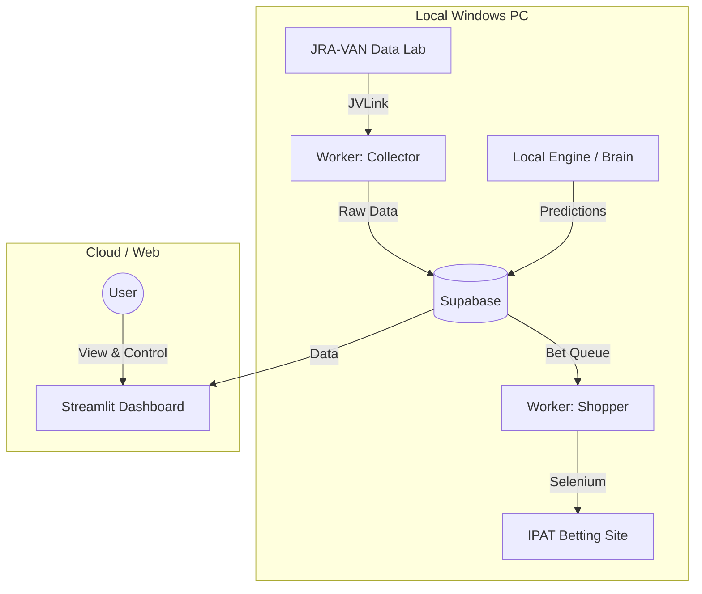

# System Overview

## Architecture
The **Horse Racing AI Dashboard** is a hybrid system combining local Windows processing (for JRA-VAN data access) and cloud-based components for visualization and data storage.

## System Components

### 1. Collector (`worker_collector.py`)
- **Role**: Data Ingestion
- **Function**: Connects to the JRA-VAN Data Lab via `JVLink` (Windows COM Object).
- **Operation**:
    - Fetches race cards (Spec `0B15`) and odds.
    - Uploads raw data to Supabase `raw_race_data` table.

### 2. Local Engine ("Brain")
- **Role**: AI Prediction
- **Location**: `local_engine/`
- **Function**:
    - `preprocess.py`: Converts raw JRA data into ML features (Time Indices, PCI, etc.).
    - `brain.py`: Loads the trained LightGBM model (`final_model.pkl`).
    - **Logic**: Identifies "profitable" horses (Expected Value > 1.34).

### 3. Shopper (`worker_shopper.py`)
- **Role**: Automated Execution
- **Function**:
    - Polls Supabase `bet_queue` for "approved" bets.
    - Logs into JRA IPAT (Rakuten Bank integration) using Selenium.
    - **Safety**:
        - Checks Daily Budget Cap (Default: ¥10,000).
        - Executes purchases and updates queue status to `purchased`.

### 4. Dashboard (`app.py`)
- **Role**: Visualization & Funds Management
- **Platform**: Streamlit
- **Features**:
    - **Asset Simulation**: Visualizes profit/loss curves.
    - **Pattern C Money Management**: Implements "Safety First" logic (cuts investment by 50% after significant drawdown).
    - **Monitoring**: Displays current betting queue and history.
